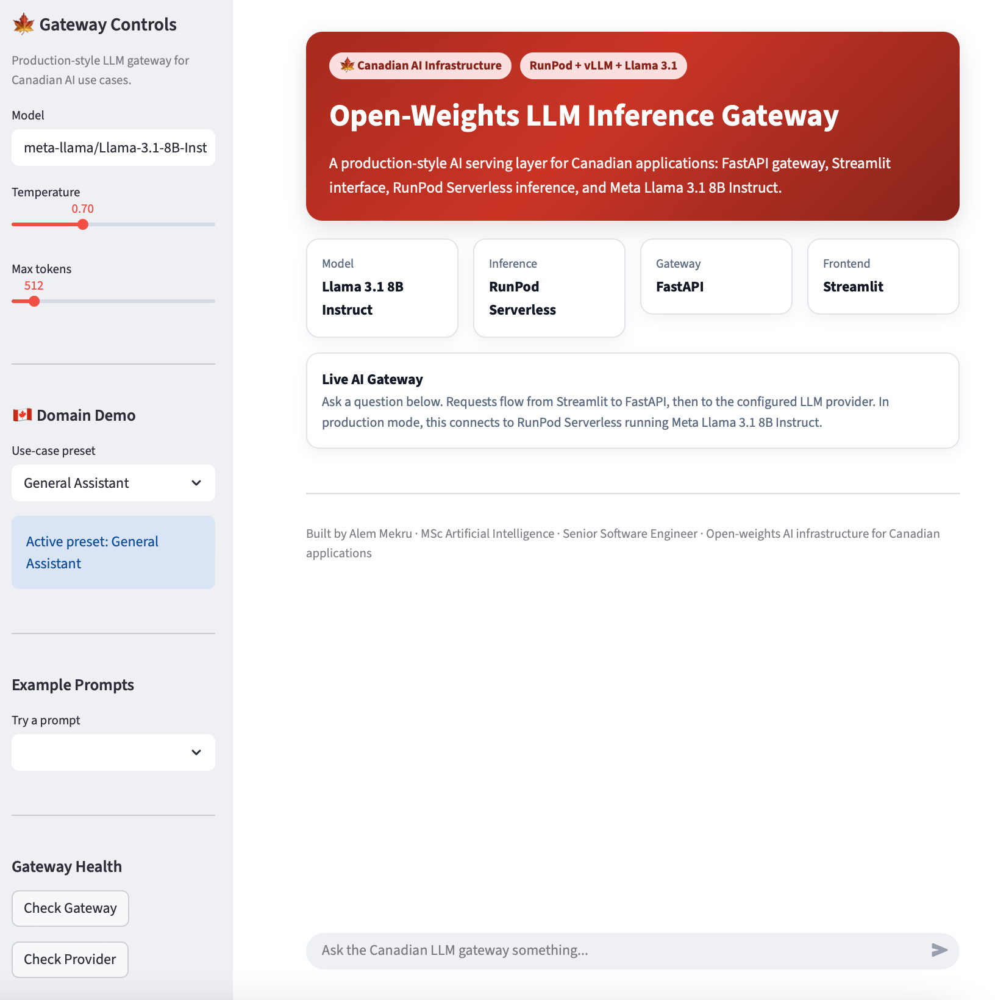
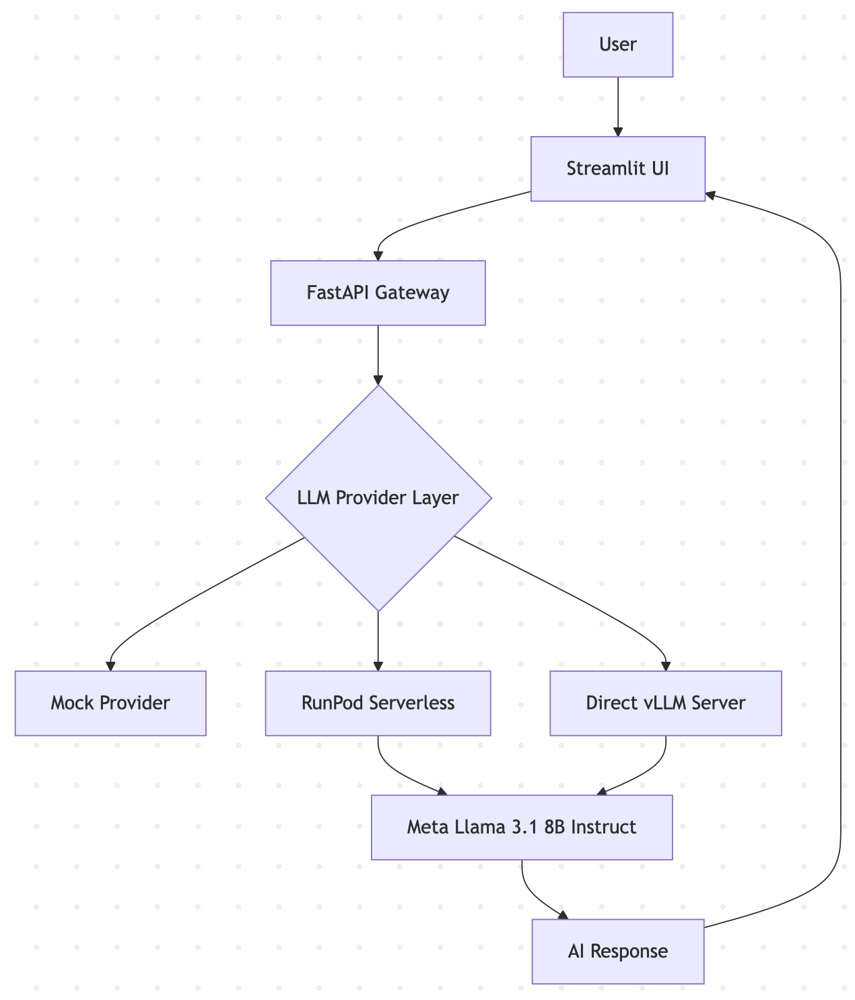
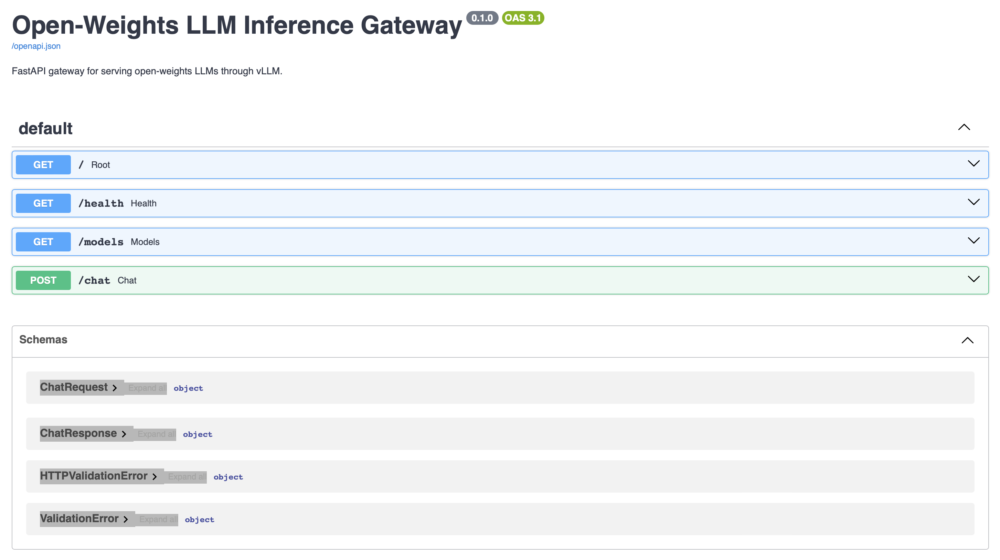
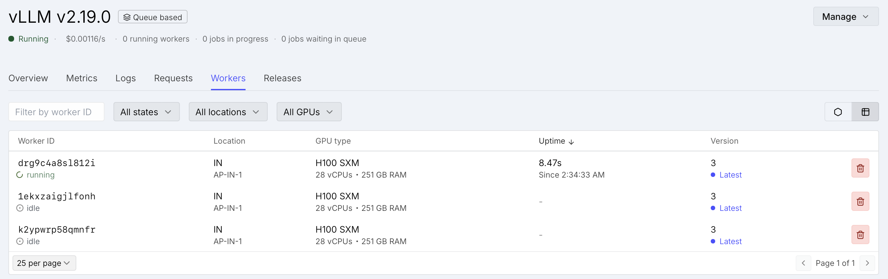

# Production LLM Gateway with RunPod Serverless and Llama 3.1

Production-grade AI inference platform using **FastAPI**, **Streamlit**, **RunPod Serverless**, **vLLM**, **Docker**, and **Meta Llama 3.1 8B Instruct**.

This project demonstrates practical AI engineering beyond API consumption, including model-serving architecture, cloud deployment, backend integration, provider abstraction, latency measurement, and production-oriented inference infrastructure.

---

## Application Interface



---
## Architecture



---

## Swagger API 



### RunPod Serverless Deployment

Meta Llama 3.1 8B Instruct served through RunPod Serverless using H100 GPUs.


## Live Demo

- Streamlit UI: https://production-llm-vllm-ui.onrender.com
- FastAPI Gateway: https://production-llm-vllm.onrender.com/docs

---

## Live Deployment

Successfully deployed using:

- RunPod Serverless
- vLLM Inference Engine
- Meta Llama 3.1 8B Instruct
- FastAPI Gateway
- Streamlit Frontend

### Example Production Test

#### Question

> What is the capital of Canada?

#### Response

> Ottawa.

#### Observed Warm Latency

**~2.8 seconds**

---

## Project Status

| Component | Status |
|------------|---------|
| FastAPI Gateway | ✅ Working |
| Streamlit UI | ✅ Working |
| Mock Provider | ✅ Working |
| RunPod Serverless Provider | ✅ Working |
| Llama 3.1 Deployment | ✅ Working |
| Real GPU Inference | ✅ Working |
| Docker Deployment | ✅ Added |
| Benchmark Framework | ✅ Added |

---

## Technology Stack

| Layer | Technology |
|---------|------------|
| Model | Meta Llama 3.1 8B Instruct |
| Inference Engine | vLLM |
| Inference Platform | RunPod Serverless |
| API Gateway | FastAPI |
| Frontend | Streamlit |
| HTTP Client | httpx |
| Configuration | python-dotenv |
| Deployment | Docker / Docker Compose |
| Language | Python |

---

## What This Project Demonstrates

- Open-weights LLM deployment
- Production-style API gateway design
- FastAPI backend development
- Streamlit application integration
- RunPod Serverless deployment
- vLLM-based model serving
- Provider abstraction architecture
- Environment-driven configuration
- AI infrastructure engineering
- Latency-aware inference systems
- Production deployment workflows

---

## Local Development

### Create Environment

```bash
python3 -m venv .venv
source .venv/bin/activate
```

### Install Dependencies

```bash
pip install -r requirements.txt
```

### Create Environment File

```bash
cp .env.example .env
```

### Run FastAPI

```bash
uvicorn gateway.main:app --reload --port 8000
```

### Run Streamlit

```bash
streamlit run frontend/streamlit_app.py
```

---

## RunPod Configuration

Example `.env`:

```env
LLM_PROVIDER=runpod
RUNPOD_ENDPOINT_ID=YOUR_ENDPOINT_ID
RUNPOD_API_KEY=YOUR_API_KEY
DEFAULT_MODEL=meta-llama/Llama-3.1-8B-Instruct
REQUEST_TIMEOUT_SECONDS=300
```

---

## API Endpoints

| Method | Endpoint | Description |
|----------|----------|-------------|
| GET | `/` | Project metadata |
| GET | `/health` | Health check |
| GET | `/models` | Provider status |
| POST | `/chat` | Chat completion |

### Example Request

```json
{
  "message": "Explain this project to a Canadian AI hiring manager.",
  "system_prompt": "You are a helpful AI assistant.",
  "temperature": 0.7,
  "max_tokens": 512
}
```

---

## Performance Summary

| Setup | Model | Platform | Average Latency |
|---------|---------|---------|----------------|
| Local Development | Mock Provider | Local | ~0s |
| Production | Llama 3.1 8B Instruct | RunPod Serverless | ~2.8s |

---

## Canadian AI Use Cases

This project is positioned as a reusable inference gateway for Canadian AI applications where controlled deployment, API ownership, and data-governance considerations matter.

Example application areas include:

- **Canadian housing decision support**: rental-risk explanation, housing stress interpretation, and user-facing explanations for ML model outputs.
- **Education and study platforms**: controlled LLM access for study-mode explanations, practice questions, and exam-preparation workflows.
- **Public-service and community assistants**: plain-language explanations of public information, multilingual support, and retrieval-augmented community tools.
- **Data-sovereignty-oriented AI systems**: architectures where the application owner can choose the model-serving region, infrastructure, logging strategy, and deployment controls.

This architecture does not automatically guarantee data sovereignty. Actual data residency depends on where the vLLM server, logs, storage, monitoring, and backups are deployed. However, it gives the application owner more control than a purely third-party hosted API design.

See [`docs/domain_use_cases.md`](docs/domain_use_cases.md) for more details.

---

## Why This Project Matters

Many AI projects demonstrate only API consumption.

This project demonstrates:

- LLM infrastructure deployment
- AI backend architecture
- Production inference integration
- Cloud-hosted model serving
- Runtime configuration management
- Deployment-oriented AI engineering

It reflects the practical engineering required to operate and integrate open-weights large language models in real-world applications.

---

## Key Engineering Concepts

- Open-weight model deployment
- Scalable inference architecture
- Provider abstraction pattern
- Cloud-native AI systems
- Production API design
- Latency optimization
- Infrastructure-as-code readiness
- Containerized deployment workflows

---

## Author

**Alem Mekru**

*MSc Artificial Intelligence*  
*Senior Software Engineer*

GitHub: https://github.com/alemmekru
LinkedIn: https://www.linkedin.com/in/alemmekru/

---
